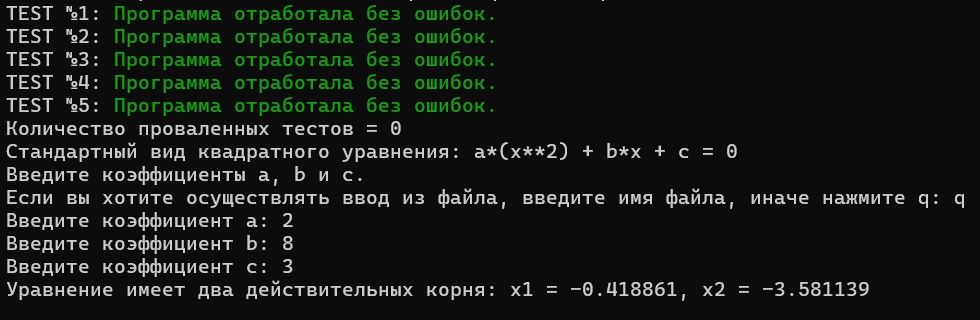

# What does this program do?
This program solves a quadratic equation with user-defined coefficients, but everything is not as simple as it seems. 

## What the program accepts as input?
It accepts command line arguments. Depending on the flags entered, it adjusts to a specific mode(s).

* ### Compilation flags for this program:
<br>

|FLAG|DESCRIPTION|
|-:|:-:|
-a|assigning a value to <br> the coefficient a (the default value is 0)|
|-b|assigning a value to <br> the coefficient a (the default value is 0)|
|-c|assigning a value to <br> the coefficient a (the default value is 0)|
|--test|conducting a unittest|
|--interactive|the usual mode of use|
|--help|displaying a list of valid compilation flags|
<br>

>*Automatically calls --help if you:*
>* *entering incorrect flags*
>* *call --help with other flags*

* ### [File with the values of the coefficients a, b and c](file_with_coef.txt) 
contains 3 rational numbers separated by a space: the values of the corresponding coefficients. 

* ### [The data file for the unittest](unitests_values.txt)
contains sets of numbers of <u>6 numbers</u> separated by a space:
1. the value of the coefficient a.
2. the value of the coefficient b.
3. the value of the coefficient c.
4. number of roots
5. the numerical value of the first root.
6. the numerical value of the second root.
<br>
<br>

>If the root does not exist, it is assigned the value 0. <br>The infinite number of roots is indicated by the number 8

* ### Coefficients are entered from the console
 sequentially. When entering non-numeric values, the user is prompted to try again.

 ## How do I run the program?
 The program consists of several files, so to run it, you need to compile each file, link it... but... fortunately, there is a Makefile to save time and run the program quickly. All you need to do is write the following command on the command line
 ```
 $ make
 ```
 and that 's it - the magic is a file with an extension .The exe has been created.

 Then we write square.exe and the desired(e) flags.

 ```
 $ square.exe <flags>
 ```
If you want to delete all files with extensions .o and the executable .exe file, write the following:

```
$ make clean
```

## What are the outputs?

When running without unit tests, the user is shown the standard form of a quadratic equation.

* ### for unittests are displayed:
    - the test number with its result 
    - the number of failed tests are displayed.
* ### for other modes are displayed:
    - the number of roots 
    - the value of each of them 

## Example og programm launch.

Let's see how the program works if it is run with the following flags
```
$ square.exe --test --interactive
```


# Solve quadratic equations using this program and don't strain yourself!


